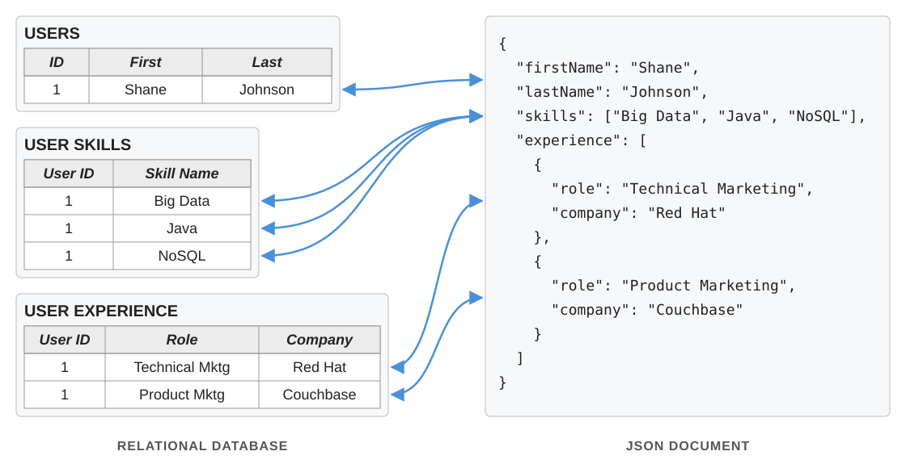
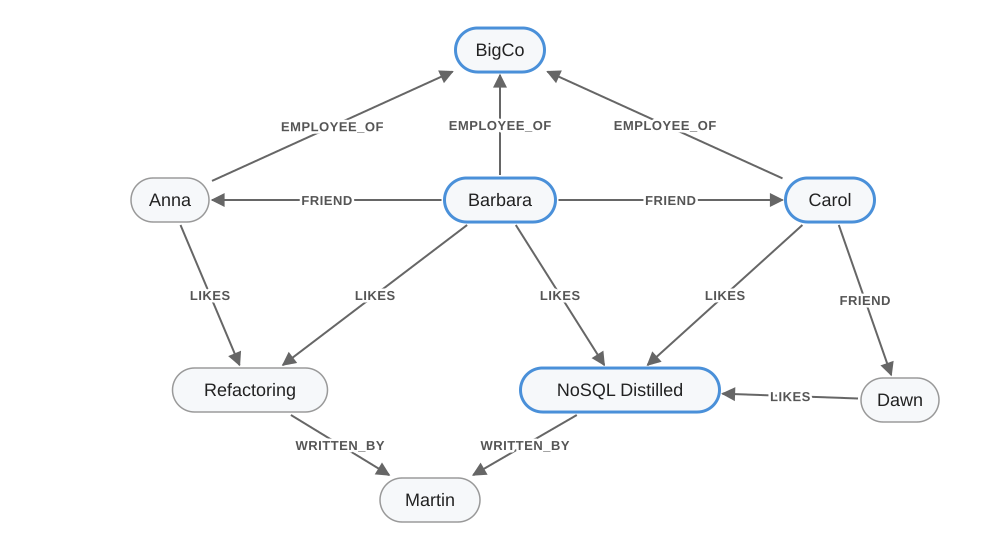

# SQL vs. NoSQL: Relational vs. Non-Relational Databases

## Agenda

* Definitions of SQL and NoSQL databases.
* Comparison.
* Pros and cons.
* Applications.
* Graph databases.
* Choosing a database for your project.

## Why Does This Matter?

* Big data and cloud computing need databases that serve a *very* large number of users.
* Distributed data storage is essential for processing large amounts of data.
	* Think of the web apps run by Google, Meta, Amazon, ...
* The web has changed the requirements for the storage systems of the next generation of applications.

> Q: Which databases have you used in your own projects? Why did you pick them?

::: notes
Open-ended. Typical answers: SQLite or PostgreSQL (came with the framework, e.g., Django/Rails), MySQL (hosting default), MongoDB (JSON fits JavaScript stacks), Firebase/Firestore (no backend to run). Point out that most choices are driven by familiarity and tooling, not by data shape or scale; the rest of the lecture gives better criteria.
:::

## Definitions

### SQL Databases

* *Relational* databases with a standard query language (SQL).

### NoSQL Databases

* NoSQL stands for "*Not Only* SQL."
* *Non-relational*, often *distributed* databases.
* An alternative to SQL aimed at fast access times and no downtime during failures.

## SQL vs. NoSQL at a Glance

| SQL | NoSQL |
|-----|-------|
| Tables with rows and columns. | Key-value pairs, documents (e.g., JSON), graphs, ... |
| Relational: links information across tables. | Non-relational: no joins; related data is embedded (documents) or linked by edges (graphs). |
| Structured query language. | No single standard query language. |
| Static schema. | Dynamic schema. |
| Supports ACID transactions. | Traditionally limited ACID support. |

> *Note*: The lines have blurred. Many NoSQL systems now offer query languages and transactions (e.g., MongoDB supports multi-document ACID transactions since version 4.0), and many SQL systems store JSON.

## Example: The Same Data, Two Ways

{title="Adapted from Couchbase."}

Example adapted from [Couchbase](https://adtmag.com/articles/2016/06/22/couchbase-4-5.aspx).

> Q: What does each representation make easy? What does each make hard?

::: notes
- Relational, easy: no duplication (each fact stored once), so updates are simple and consistent; ad hoc queries across entities (e.g., "all users who know Java" or "all companies"); constraints and foreign keys enforce integrity.
- Relational, hard: reading one user means joining three tables; changing structure needs a schema migration.
- Document, easy: reading or writing one user is a single lookup with no joins; the document maps directly to objects in code; adding a field needs no migration; easy to shard by user.
- Document, hard: queries across documents (e.g., "everyone who worked at Red Hat") need extra indexes or scans; duplicated data (e.g., a company's name in many documents) must be updated everywhere; no enforced structure.
:::

## Data Model

* NoSQL databases use many modeling techniques:
	* Key-value pairs (e.g., Redis, Amazon DynamoDB).
		* Values are opaque to the database: look them up only by key.
	* Documents (e.g., MongoDB, Couchbase).
		* Values are structured (e.g., JSON): the database can query and index fields inside them.
	* Graphs (e.g., Neo4j).
		* Nodes connected by typed edges: queries follow relationships.
	* Wide columns (e.g., Google Bigtable, Apache Cassandra).
		* Unlike relational tables, rows need not share columns, and one row can have millions of them (e.g., a sensor's row gains a new column for each reading).
* A NoSQL system may combine two or more of these models.
* Schema-less, so very efficient at handling *unstructured* data.

::: notes
Key-value vs. document: the difference is whether the database can see *inside* the value.

- Key-value: the value is opaque to the database; only `get`, `put`, and `delete` by key. E.g., `user:1 → {...}` can be fetched by key, but "all users who know Java" means reading every value yourself. Very fast and simple: caches, sessions, shopping carts (e.g., Redis, DynamoDB).
- Document: the value is a structured document (JSON, or BSON in MongoDB) that the database understands, so fields inside it can be queried and indexed (`db.users.find({skills: "Java"})`) and updated individually. Suits records like the Shane example (e.g., MongoDB, Couchbase).
- In short, a document store is a key-value store whose values the database can query. The line is blurry: DynamoDB supports both styles, and Redis can store and query JSON with a module.
:::

## Scalability

### Vertical Scaling (Scale Up)

* Relational databases traditionally scale *vertically*: add more hardware (RAM, CPU, ...) to one machine.
* Costly, and limited by what a single machine can hold.

### Horizontal Scaling (Scale Out)

* NoSQL databases are designed to scale *horizontally*: add more machines.
* Traditional SQL databases are not built around this model.
* Requires *partitioning* (sharding) data across machines, which adds complexity (e.g., queries that span machines).

> *Note*: Relational databases can also scale out, e.g., via sharding (Vitess for MySQL, Citus for PostgreSQL) or distributed SQL databases (Google Spanner, CockroachDB). It is harder than with NoSQL, not impossible.

> Q: What new problems appear once data is spread across many machines?

::: notes
- Partitioning: choosing a shard key; hot spots; rebalancing when adding machines.
- Queries across machines: cross-shard joins and aggregations are slow, hence denormalization (as in the JSON example).
- Transactions: atomic updates across machines need coordination (e.g., two-phase commit), which is slow and blocks on failures.
- Replication and consistency: replicas lag, so reads may be stale (eventual consistency); concurrent writes can conflict.
- Partial failures and the CAP theorem: during a network partition, choose consistency or availability, not both.
- Time and ordering: clocks disagree, so "which write was last?" is hard.
- Operations: monitoring, backups, upgrades, and debugging get harder.
- Tie-back: these are the costs of scaling out. NoSQL accepts some (weaker consistency, no joins); distributed SQL (e.g., Spanner) pays to solve them.
:::

## Cloud

* Relational databases were traditionally less suited to cloud environments.
	* Hard to grow and shrink capacity on demand.
* NoSQL databases fit cloud databases well.
	* Their defining characteristics (distribution, horizontal scaling) are exactly what cloud databases need.

> *Note*: Today, managed relational services (e.g., Amazon RDS and Aurora, Google Cloud SQL, Azure SQL Database) are among the most widely used cloud databases. The provider handles replication, failover, backups, and resizing, and some (e.g., Aurora Serverless) grow and shrink capacity on demand.

## Complexity

* In relational databases, users must convert data into tables.
* When data does not fit those tables, the database structure can become complex, difficult, and slow to process.
* Code works with objects, not tables (the *object-relational impedance mismatch*).
	* Object-Relational Mapping (ORM) libraries (e.g., Hibernate, Django ORM, SQLAlchemy) bridge the gap.
	* Document databases reduce the mismatch: a document's structure (nested fields, lists) matches an object's.
		* Object-Document Mappers (ODMs) (e.g., Mongoose) add classes and methods, as ORMs do.

::: notes
ORMs also let you query in terms of classes and fields rather than tables and columns, and translate the query to SQL: e.g., Hibernate's HQL (standardized in JPA as JPQL), `SELECT p FROM Person p JOIN p.employer c WHERE c.name = 'BigCo'`, or Django's `Person.objects.filter(employer__name="BigCo")`. ODMs have the same (e.g., Mongoose's `Person.find({"employer.name": "BigCo"})`), which stays close to MongoDB's own query language because documents already have the objects' shape.
:::

## NoSQL and Agile Development

* NoSQL is often a good fit for Agile development.
* Dynamic schemas and scalability go hand in hand with the Agile approach.
* Incremental, feature-driven development benefits from being able to choose or change the data model *during* development.
* Flexible handling of unstructured data accommodates changing specifications.
	* Agile avoids strict, detailed up-front planning of the product.
* Makes it easier to expand the product's functionality to reach new users.

> Q: What is the risk of a schema that can change at any time? Who enforces the structure instead?

::: notes
- Risks: inconsistent records (e.g., `firstName` vs. `first_name`, a field missing or of a different type in old documents); typos silently create new fields; code must handle every historical shape of the data; bugs show up at read time rather than write time.
- Who enforces it: the application code ("schema-on-read"). Common tools: ORM/ODM models (e.g., Mongoose), validation libraries, optional database-side validation (e.g., MongoDB JSON Schema validation), tests, and migration scripts that rewrite old documents.
- Takeaway: there is always a schema; the question is whether the database or the application enforces it.
:::

## Applications

NoSQL databases are well suited for:

* Business applications with continuously growing unstructured data.
* Applications accessed by a large number of users.
	* E.g., e-commerce websites.
* Websites with very large and growing datasets.
	* E.g., social media networks (millions of posts daily).

> Q: When would you still choose a relational database?

::: notes
- Data is structured and highly related, with many-to-many relationships and frequent joins.
- Strong consistency and multi-row transactions are required (e.g., banking, inventory, orders).
- Integrity must be enforced by the database (constraints, foreign keys).
- Many ad hoc queries, reporting, or analytics, where SQL shines.
- Data fits on one machine, or can be scaled with replicas or sharding; that covers most applications.
- The team knows SQL and the tooling is mature.
- Reasonable default: start relational and add NoSQL for specific needs (e.g., caching, search, very high write volume).
:::

## Graph Databases

* Store *entities* (nodes) and the *relationships* between them (edges).
	* Nodes and edges have properties (e.g., `name`, `since`).
	* Edges are directed and have types (e.g., `FRIEND`, `LIKES`, `EMPLOYEE_OF`).
* Relationships are stored, not computed at query time.
	* Queries follow edges directly instead of joining tables.
	* Shifts work from queries to inserts, keeping queries fast.
* Examples: Neo4j, Amazon Neptune, Memgraph, TigerGraph.
	* Standard query language: GQL (ISO/IEC 39075, 2024).

Adapted from [Holubová][holubova].

## Example: A Social Graph

{title="Adapted from Holubová, after Sadalage and Fowler."}

Example adapted from [Holubová][holubova], after Sadalage and Fowler's *NoSQL Distilled*.

> Q: Who is employed by BigCo and likes *NoSQL Distilled*?

::: notes
Barbara and Carol (outlined in blue). Anna works at BigCo but likes only *Refactoring*; Dawn likes *NoSQL Distilled* but does not work at BigCo. In a graph database, the query starts at BigCo or the book and follows edges; no joins are needed. The next slide shows the same query in SQL and Cypher.
:::

## Relational vs. Graph

:::::::::::::: {.columns}
::: {.column width="50%"}

### SQL

```sql
SELECT p.name
FROM people p
JOIN employment e ON e.person_id = p.id
JOIN companies c ON c.id = e.company_id
JOIN likes l ON l.person_id = p.id
JOIN books b ON b.id = l.book_id
WHERE c.name = 'BigCo'
  AND b.title = 'NoSQL Distilled';
```

:::
::: {.column width="50%"}

### Cypher (Neo4j)

```cypher
MATCH (p:Person)-[:EMPLOYEE_OF]->(c),
      (p)-[:LIKES]->(b)
WHERE c.name = 'BigCo'
  AND b.title = 'NoSQL Distilled'
RETURN p.name;
```

:::
::::::::::::::

* A new kind of relationship usually means a new table in a relational schema; in a graph, it is just a new edge type.
* Deep traversals (e.g., friends of friends of friends) need one join per hop or recursive SQL (`WITH RECURSIVE`); in Cypher, a path pattern: `(p)-[:FRIEND*1..3]->(f)`.

Adapted from [Holubová][holubova].

## Graph Databases: When to Use

### Good Fit

* Connected data: social networks, any link-rich domain.
* Routing and location-based services: nodes are locations, edges are distances.
* Recommendations: "your friends also bought this product."

### Poor Fit

* Updating a property on all or most entities (e.g., bulk analytics updates).
* Very large graphs: distributing a graph is hard because edges cross machines (see [Scalability](#scalability)).
* Simple, tabular data with few relationships: a relational database is simpler.

Adapted from [Holubová][holubova].

## Choosing a Database for Your Project

* Start with the kind of data your application processes:
	* Tabular, related data (users, orders, enrollments, ...) → relational database (e.g., PostgreSQL, or SQLite for small projects).
	* Semi-structured records whose fields vary (e.g., JSON) → consider a document database (e.g., MongoDB).
	* Highly connected data queried by its relationships (e.g., social networks) → consider a graph database (e.g., Neo4j).
* Then check how you will query it:
	* Joins, transactions, or ad hoc queries → lean relational.
	* Whole records by key at very high scale → lean NoSQL.
* When unsure, start relational; mixing is common (e.g., PostgreSQL plus Redis for caching).

> Q: What kind of data will your project process? Which database would you choose? Why?

## Summary

* NoSQL does not use the relational data model, and thus not SQL as its primary language.
* In distributed environments (data spread across machines), NoSQL is designed to keep working.
	* A fault or failure on one machine need not interrupt the service.
* Many NoSQL databases are open source and free to use.
* NoSQL stores records without a fixed schema.
* NoSQL traditionally relaxes ACID properties.
* NoSQL scales horizontally by adding machines.
* Neither is better in general: choose by your data and how you query it; relational is a good default.

## References

1. Dave, M. (2012). SQL and NoSQL Databases. *International Journal of Advanced Research in Computer Science and Software Engineering*.
1. Mohamed, M., Altrafi, O., & Ismail, M. (2014). Relational vs. NoSQL Databases: A Survey. *International Journal of Computer and Information Technology (IJCIT)*, 3, 598.
1. Nayak, A., Poriya, A., & Poojary, D. (2013). Type of NoSQL Databases and Its Comparison with Relational Databases. *International Journal of Applied Information Systems*, 5, 16–19.
1. Padhy, R. P., Patra, M. R., & Satapathy, S. C. (2011). RDBMS to NoSQL: Reviewing Some Next-Generation Non-Relational Database's. *International Journal of Advanced Engineering Sciences and Technologies*, 11(1), 15–30.
1. [MongoDB](https://www.mongodb.com/).
1. [Why NoSQL Is the Perfect Fit for Agile Development](https://www.dragonspears.com/blog/why-nosql-is-the-perfect-fit-for-agile-development). DragonSpears.
1. Holubová, I. (2015). [Graph Databases][holubova]. Lecture 10, *Big Data Management and NoSQL Databases* (NDBI040), Charles University.
1. Sadalage, P. J., & Fowler, M. (2012). *NoSQL Distilled: A Brief Guide to the Emerging World of Polyglot Persistence*. Addison-Wesley.

[sql-nosql]: https://s3.amazonaws.com/files.commons.gc.cuny.edu/wp-content/blogs.dir/2880/files/2021/05/SQL_NoSQL.pdf
[holubova]: https://www.ksi.mff.cuni.cz/~svoboda/courses/2015-1-NDBI040/lectures/Lecture-10-Graph.pdf
